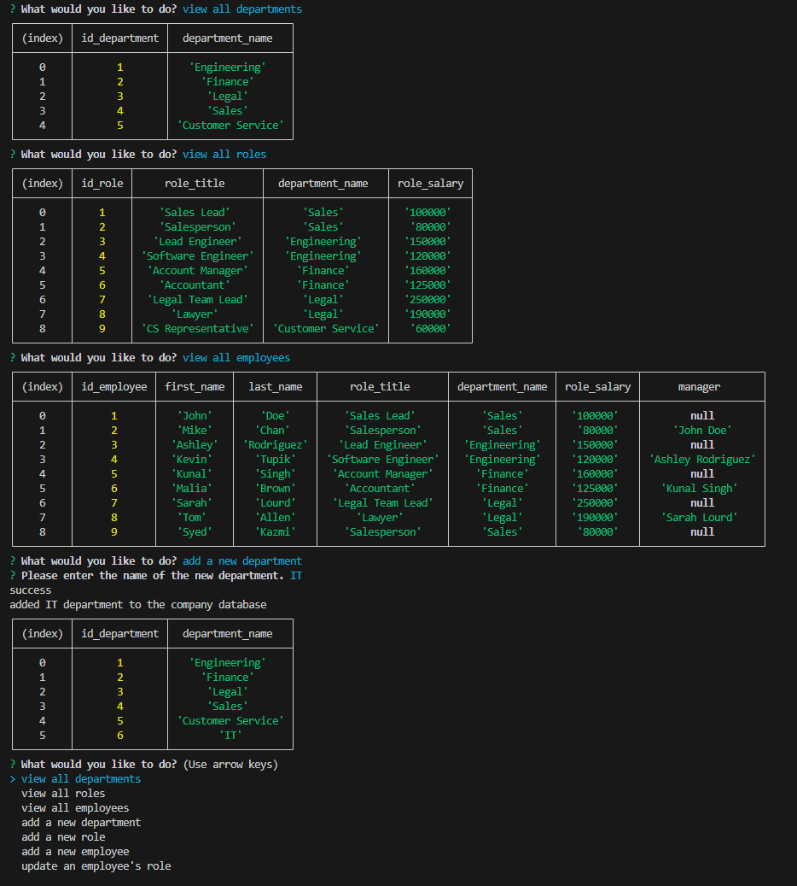

# SQL Employee Tracker

The SQL Employee Tracker node application was created to allow a manager to access the company's relational database. Using a set of inquirer prompts and mysql2 queries, the user can view and update the departments, roles, and employee data in the company database.

## Features

- User prompts using npm inquirer library to obtain user inputs for viewing and updating the company database tables.
- mysql2 library is used to connect with mysql database to interact with company database and the tables inside.
- async/await js. functions used to create a sequence of queries and inquirer prompts as needed to work on the company database tables.
- User can do the following methods on the company database:
  - get the departments table
  - get the roles table
  - get the employees table
  - add a new department
  - add a new role
  - add a new employee
  - update an employee role

## Appendix

https://www.npmjs.com/package/inquirer/v/8.2.4

https://www.npmjs.com/package/mysql2

https://dev.mysql.com/doc/refman/8.0/en/create-table-foreign-keys.html

https://learnsql.com/blog/how-to-join-3-tables-or-more-in-sql/

https://stackoverflow.com/questions/20284528/how-to-concat-two-columns-into-one-with-the-existing-column-name-in-mysql

https://www.youtube.com/watch?v=Xnj3qGFAR8U

https://coding-boot-camp.github.io/full-stack/computer-literacy/video-submission-guide

## Authors

- [Syed Kazmi](https://github.com/kazmiali123)

## Deployment

GitHub Repository: https://github.com/kazmiali123/Challange12-SQL-Employee-Tracker

Walkthrough Video: https://drive.google.com/file/d/1PCr11ZVl3EaYc2s-iIHspN5WWZc8WNiV/view

## Demo

